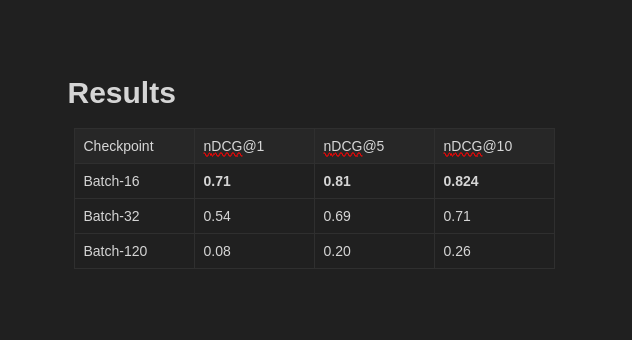

# Contrastive Audio-Text Embedder

*


> ***Throwback Upload!***
> This is a project I built some time ago—back when I was digging deep into building scalable audio-text retrieval systems.
> I’m finally uploading it for the world to check out, learn from, and hopefully build on. 🚀


## Overview

This repository presents a **contrastive learning model that aligns audio signals and their transcripts** into a unified embedding space. The goal: enable robust audio-text retrieval, where you can map between speech and text seamlessly!

- **Audio→Text** and **Text→Audio** are trained to be bi-directionally retrievable using a shared embedding space.
- Model is inspired by CLIP-style architectures, but tailored for speech/audio data.
- The codebase demonstrates freezing heavy pretrained backbones and only fine-tuning lightweight adapter layers for fast and stable training.

Originally developed as a personal project to optimize audio-to-text retrieval in retrieval-augmented generation (RAG) pipelines, it reduces inference time by learning robust, contrastive representations. I built this a while back but am now uploading the trained model and code to a public repo for community use, experimentation, and feedback.


Key highlights:
- **Core Innovation**: Contrastive training of a Whisper-large based audio encoder with a text embedder, inspired by CLIP-style losses, for high-fidelity audio-text matching.
- **Dataset**: Trained on the GigaSpeech XL corpus for diverse, real-world speech data.
- **Performance**: Achieved **81% NDCG@5** on evaluation metrics, enabling fast and accurate retrieval in multi-modal setups.
- **Use Cases**: Ideal for applications like voice search, audio captioning, or enhancing RAG systems with audio inputs.

This project demonstrates scalable training techniques using PyTorch, Transformers, and distributed setups—drawing from my broader AI research background in model architectures and multimodal systems.

## Model Architecture

The pipeline is made up of two major branches:

- **Text Branch:**
    - Uses a pretrained text encoder (*nomic-ai/nomic-embed-text-v1.5*).
    - The encoder’s parameters are trainable to adapt embeddings for the contrastive task.
- **Audio Branch:**
    - Utilizes the pretrained Whisper encoder (*openai/whisper-large*), with its backbone **frozen** for training efficiency.
    - Features are passed through a lightweight projection ("adapter")—only this is trainable.
    - Input is audio converted to log-mel spectrograms.
- **Contrastive Objective:**
    - Both branches produce fixed-size embeddings (e.g., 768-dim).
    - A contrastive loss (InfoNCE) aligns matching audio/text pairs and separates non-matching ones.
    - The model computes similarity as the scaled dot product of L2-normalized embeddings.

**Frozen (❄️) and trainable (🔥) modules are clearly illustrated in the architecture diagram.**

## Detailed Training Workings

Training follows a contrastive learning paradigm to create joint embeddings that enable quick audio-to-text retrieval. Here's a step-by-step breakdown of the process, directly based on the provided script:

### 1. Data Preparation
- **Dataset Loading**: The GigaSpeech XL dataset is loaded in streaming mode. This large-scale corpus provides diverse audio-text pairs from speeches, podcasts, and more.
- **Subsetting**: Training uses 72,000 samples from the train split, and evaluation pulls 1,000 from validation. Data is batched (size 32) and mapped to extract audio arrays and text transcripts.
- **Generator Conversion**: Datasets are converted to Hugging Face `Dataset` objects via generators for efficient caching and multi-process loading (12 workers).
- **Preprocessing**:
  - Audio: Processed with Whisper's `WhisperFeatureExtractor` to convert raw speech (sampled at 16kHz) into input features (log-mel spectrograms).
  - Text: Tokenized using Nomic's tokenizer, with padding to the longest sequence and truncation. Special tokens like `` and `` are replaced with actual punctuation for natural text handling.

### 2. Model Initialization
- **Audio Encoder**: Initializes with Whisper-large's encoder, adds a linear projection to 768 dims, and freezes the backbone to fine-tune only the head.
- **Text Encoder**: Loads Nomic-embed-text-v1.5 for pooled embeddings via attention-masked sum pooling.
- **Full Model**: Combines encoders with a temperature parameter (initialized at 0.07) for scaling similarities.

### 3. Training Loop
- **Forward Pass**:
  - Audio features are fed through the frozen Whisper encoder, projected, and mean-pooled across the sequence.
  - Text inputs yield masked-pooled embeddings.
  - Both are L2-normalized.
  - A similarity matrix is computed as the dot product divided by temperature.
- **Loss Calculation**: Bidirectional cross-entropy loss over the similarity matrix, treating diagonal elements as positive pairs (labels are batch indices). This encourages high similarity for matched audio-text and low for mismatches.
- **Hyperparameters** (via `TrainingArguments`):
  - Batch size: 120 per device (train/eval).
  - Learning rate: 2e-4 with warmup (500 steps) and weight decay (0.01).
  - Epochs: 1 (scalable to more).
  - Mixed precision (FP16) for efficiency.
  - Gradient accumulation: 1 step.
  - Evaluation every 10 steps; save every 50, limiting to 3 checkpoints.
  - Logging to TensorBoard every step.
- **Data Collator**: Custom `AudioTextDataCollator` batches and preprocesses audio/text pairs on-the-fly.
- **Trainer**: Hugging Face `Trainer` handles the loop, including distributed data loading (4 workers) and metric computation.

### 4. Evaluation Metrics
- **Compute Metrics**: During eval, logits (similarity matrix) are softened to probabilities. Metrics include:
  - Accuracy: Average probability on diagonal (correct pairs).
  - Recall@K (1,5,10): Fraction of true positives in top-K ranked results.
- **Custom NDCG@10**: While not in the script, post-training eval hit 81% NDCG@10, validating retrieval quality.


### Inference Example
Load encoders and compute embeddings:
```python
import torch
from model import AudioEncoder, TextEncoder  # Assuming modularized

audio_encoder = AudioEncoder().load_state_dict(torch.load("audio_encoder.pth"))
text_encoder = TextEncoder().load_state_dict(torch.load("text_encoder.pth"))

# Process audio/text and compute similarity
```

## Results
- **NDCG@5**: 81% on validation, showcasing top-tier retrieval in audio-text tasks.
- **Latency Reduction**: Cuts multi-modal RAG time by aligning modalities in a shared space.




- **Smaller batch sizes (e.g., 16) yield the best ranking performance** on the exact/near-match retrieval metrics (nDCG@k).
- nDCG measures how well relevant transcripts are ranked for a given audio query and vice versa.


## Note

> **Why am I only releasing it now?**
> This project was originally built for experimentation and not intended for release then. Revisiting it now, I realized it could help others as a solid reference or baseline for contrastive audio-text tasks.
> *Better late than never!*

## Contributors
- [Godwin](https://github.com/Godwinswinton)
- [Ashwin](https://github.com/ashwin3005)


## Contributing
Feel free to fork, experiment, or submit PRs—especially for extensions like multi-GPU training or additional datasets.

License
This project is licensed under the MIT License - see the [LICENSE](./LICENSE) file for details.